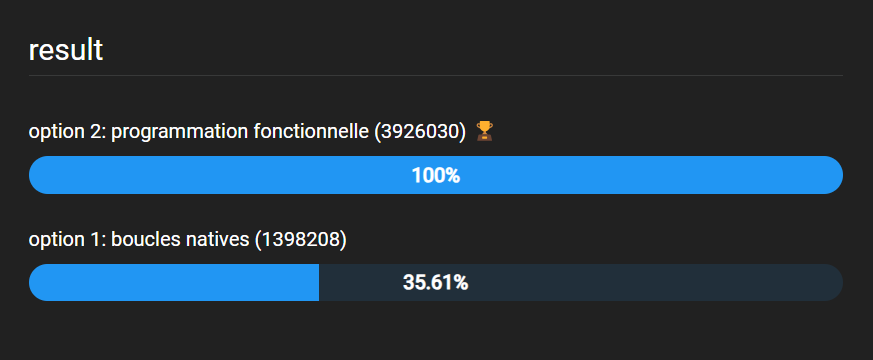

# 

Le projet consiste à développer un algorithme de recherche efficace pour une plateforme de recettes de cuisine.

La première tâche sera de concevoir l'interface utilisateur du site en utilisant un framework front-end. Cela comprendra la création d'une interface intuitive et réactive pour la fonction de recherche des recettes.

 

Il faudra ensuite développer deux versions d'un algorithme de recherche, capables de parcourir et de filtrer efficacement un fichier JSON.
 

Après avoir implémenté ces algorithmes, il faudra analyser et comparer leurs performances.
En utilisant des outils comme Jsben.ch ou d'autres outils de test de performances pour identifier l'algorithme le plus efficace.

 
Une fois l'algorithme optimal choisi, il sera nécessaire de documenter le travail et d'expliquer pourquoi cet algorithme est le plus adapté pour le site.

Durant tout le projet, il faudra prendre en compte les principes du Green Code, afin de développer un algorithme qui soit non seulement performant mais aussi respectueux de l'environnement.

## étape de réalisation

1. implémenter l'interface (avec bootstrap/tailwind)
2. remplir le document d’investigation de fonctionnalité
3. faire un algorigramme pour chacune des propositions
4. développer les algorithmes de recherche :
- une version avec les boucles natives (while, for...)
- une version en programmation fonctionnelle avec les méthodes de l'objet array (foreach, filter, map, reduce)
5. choisir le meilleur algorithme en testant leur performance ([jsben.ch](https://jsben.ch/))

## analyse des performances 

